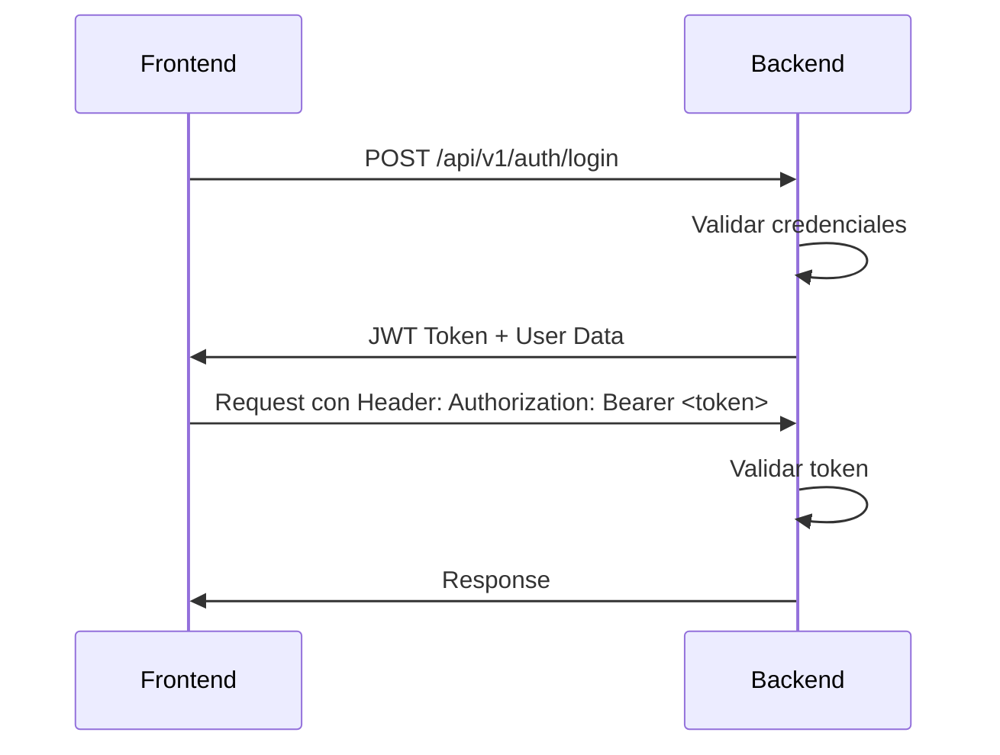

# 🔐 Sistema de Autenticación y Autorización

## 📋 Tabla de Contenidos
1. [Introducción](#introducción)
2. [Roles del Sistema](#roles-del-sistema)
3. [Autenticación JWT](#autenticación-jwt)
4. [Autorización por Roles](#autorización-por-roles)
5. [Endpoints por Rol](#endpoints-por-rol)
6. [Uso en Frontend](#uso-en-frontend)
7. [Manejo de Errores](#manejo-de-errores)
8. [Ejemplos Prácticos](#ejemplos-prácticos)

---

## 🎯 Introducción

El sistema utiliza **JWT (JSON Web Tokens)** para autenticación y **guards basados en roles** para autorización. Todos los endpoints están protegidos por defecto, excepto los marcados como públicos.

### Características Principales:
- ✅ **Autenticación JWT**: Token Bearer en el header
- ✅ **Autorización por Roles**: 3 roles (admin, employee, customer)
- ✅ **Guards Globales**: Protección automática de todos los endpoints
- ✅ **Decoradores Simplificados**: Fácil de usar y entender

---

## 👥 Roles del Sistema

### 1. **ADMIN** (`admin`)
**Acceso completo al sistema**
- Dashboard y reportes
- Gestión completa de inventario, proveedores, mesas, productos
- Eliminación de registros
- Promoción de clientes VIP
- Ajustes de stock

### 2. **EMPLOYEE** (`employee`)
**Acceso operativo**
- Ver inventario, proveedores, mesas, productos
- Gestionar reservas (confirmar, sentar, completar, cancelar)
- Gestionar clientes (ver, actualizar, agregar notas)
- Gestionar waitlist
- Ver pedidos y facturas
- Consumir stock

### 3. **CUSTOMER** (`customer`)
**Acceso limitado**
- Crear reservas
- Verificar disponibilidad
- Crear perfil de cliente
- Ver menú (productos)

---

## 🔑 Autenticación JWT

### Flujo de Autenticación



### Estructura del Token JWT

El token JWT contiene:
```json
{
  "sub": "user-id-uuid",
  "email": "user@example.com",
  "role": "admin" | "employee" | "customer",
  "iat": 1234567890,
  "exp": 1234567890
}
```

### Payload del Usuario (después de validar)

Cuando el token es válido, el backend añade el objeto `user` al request:
```typescript
{
  userId: string;
  email: string;
  role: 'admin' | 'employee' | 'customer';
}
```

---

## 🛡️ Autorización por Roles

### Decoradores Disponibles

#### 1. `@Public()`
**Sin autenticación requerida**
```typescript
@Public()
@Get('products')
findAll() {
  // Cualquiera puede acceder sin token
}
```

#### 2. `@AdminOnly()`
**Solo administradores**
```typescript
@AdminOnly()
@Get('dashboard')
getDashboard() {
  // Solo usuarios con role='admin'
}
```

#### 3. `@AdminOrEmployee()`
**Administradores o empleados**
```typescript
@AdminOrEmployee()
@Get('inventory')
findAll() {
  // Usuarios con role='admin' o role='employee'
}
```

#### 4. `@Roles(UserRole.ADMIN, UserRole.EMPLOYEE)`
**Roles específicos (uso avanzado)**
```typescript
@Roles(UserRole.ADMIN, UserRole.EMPLOYEE)
@Get('customers')
findAll() {
  // Control manual de roles
}
```

---

## 📊 Endpoints por Rol

### 🔓 Públicos (Sin Autenticación)

| Endpoint | Método | Descripción |
|----------|--------|-------------|
| `/api/v1/auth/login` | POST | Iniciar sesión |
| `/api/v1/auth/register` | POST | Registrar usuario |
| `/api/v1/products` | GET | Ver menú (productos) |
| `/api/v1/tables` | GET | Ver mesas disponibles |
| `/api/v1/tables/:id` | GET | Ver mesa específica |
| `/api/v1/reservations` | POST | Crear reserva |
| `/api/v1/reservations/check` | GET | Verificar disponibilidad |
| `/api/v1/reservations/code/:code` | GET | Buscar por código de confirmación |
| `/api/v1/customers` | POST | Crear perfil de cliente |
| `/api/v1/waitlist` | POST | Agregar a lista de espera |

---

### 👑 Solo ADMIN

| Módulo | Endpoint | Método | Descripción |
|--------|----------|--------|-------------|
| **Admin** | `/api/v1/admin/dashboard` | GET | Dashboard con métricas |
| **Reports** | `/api/v1/reports/sales` | GET | Reporte de ventas |
| **Inventory** | `/api/v1/inventory` | POST | Crear item de inventario |
| **Inventory** | `/api/v1/inventory/:id` | PATCH | Actualizar item |
| **Inventory** | `/api/v1/inventory/:id` | DELETE | Eliminar item |
| **Inventory** | `/api/v1/inventory/:id/adjust-stock` | POST | Ajustar stock |
| **Inventory** | `/api/v1/inventory/value` | GET | Valor total del inventario |
| **Suppliers** | `/api/v1/suppliers` | POST | Crear proveedor |
| **Suppliers** | `/api/v1/suppliers/:id` | PATCH | Actualizar proveedor |
| **Suppliers** | `/api/v1/suppliers/:id` | DELETE | Eliminar proveedor |
| **Suppliers** | `/api/v1/suppliers/:id/update-order-stats` | POST | Actualizar estadísticas |
| **Tables** | `/api/v1/tables` | POST | Crear mesa |
| **Tables** | `/api/v1/tables/:id` | PUT | Actualizar mesa |
| **Tables** | `/api/v1/tables/:id` | DELETE | Eliminar mesa |
| **Customers** | `/api/v1/customers/:id/manage?action=promote-vip` | PATCH | Promover a VIP |
| **Customers** | `/api/v1/customers/:id/manage?action=remove-vip` | PATCH | Quitar VIP |
| **Customers** | `/api/v1/customers/:id` | DELETE | Eliminar cliente |
| **Reservations** | `/api/v1/reservations/:id` | DELETE | Eliminar reserva |

---

### 👔 ADMIN + EMPLOYEE

| Módulo | Endpoint | Método | Descripción |
|--------|----------|--------|-------------|
| **Inventory** | `/api/v1/inventory` | GET | Ver inventario |
| **Inventory** | `/api/v1/inventory/low-stock` | GET | Ver stock bajo |
| **Inventory** | `/api/v1/inventory/:id` | GET | Ver item específico |
| **Inventory** | `/api/v1/inventory/movements` | GET | Ver movimientos |
| **Inventory** | `/api/v1/inventory/:id/consume` | POST | Consumir stock |
| **Suppliers** | `/api/v1/suppliers` | GET | Ver proveedores |
| **Suppliers** | `/api/v1/suppliers/:id` | GET | Ver proveedor específico |
| **Suppliers** | `/api/v1/suppliers/top-by-volume` | GET | Top proveedores |
| **Suppliers** | `/api/v1/suppliers/by-payment-terms` | GET | Por términos de pago |
| **Reservations** | `/api/v1/reservations` | GET | Ver reservas |
| **Reservations** | `/api/v1/reservations/:id` | GET | Ver reserva específica |
| **Reservations** | `/api/v1/reservations/:id` | PATCH | Actualizar reserva |
| **Reservations** | `/api/v1/reservations/:id/status` | PATCH | Cambiar estado |
| **Customers** | `/api/v1/customers` | GET | Ver clientes |
| **Customers** | `/api/v1/customers/:id` | GET | Ver cliente específico |
| **Customers** | `/api/v1/customers/:id/reservations` | GET | Historial de reservas |
| **Customers** | `/api/v1/customers/:id` | PATCH | Actualizar cliente |
| **Customers** | `/api/v1/customers/:id/manage?action=add-note` | PATCH | Agregar nota |
| **Waitlist** | `/api/v1/waitlist` | GET | Ver waitlist |
| **Waitlist** | `/api/v1/waitlist/:id` | PATCH | Actualizar entrada |
| **Waitlist** | `/api/v1/waitlist/:id` | DELETE | Eliminar entrada |
| **Waitlist** | `/api/v1/waitlist/maintenance` | POST | Mantenimiento |
| **Stock Movements** | `/api/v1/stock-movements` | GET | Ver movimientos |
| **Stock Movements** | `/api/v1/stock-movements/*` | GET | Todos los endpoints |
| **Orders** | `/api/v1/orders` | GET | Ver pedidos |
| **Bills** | `/api/v1/bills` | GET | Ver facturas |

---

## 💻 Uso en Frontend

### 1. Configurar Interceptor de Axios

```typescript
// axios.config.ts
import axios from 'axios';

const apiClient = axios.create({
  baseURL: 'http://localhost:3004/api/v1',
});

// Interceptor para añadir token automáticamente
apiClient.interceptors.request.use((config) => {
  const token = localStorage.getItem('access_token');
  if (token) {
    config.headers.Authorization = `Bearer ${token}`;
  }
  return config;
});

// Interceptor para manejar errores de autenticación
apiClient.interceptors.response.use(
  (response) => response,
  (error) => {
    if (error.response?.status === 401) {
      // Token expirado o inválido
      localStorage.removeItem('access_token');
      window.location.href = '/login';
    }
    if (error.response?.status === 403) {
      // Sin permisos
      alert('No tienes permisos para realizar esta acción');
    }
    return Promise.reject(error);
  }
);

export default apiClient;
```

### 2. Servicio de Autenticación

```typescript
// auth.service.ts
import apiClient from './axios.config';

export interface LoginCredentials {
  email: string;
  password: string;
}

export interface AuthResponse {
  access_token: string;
  user: {
    userId: string;
    email: string;
    role: 'admin' | 'employee' | 'customer';
  };
}

export const authService = {
  async login(credentials: LoginCredentials): Promise<AuthResponse> {
    const response = await apiClient.post('/auth/login', credentials);
    const { access_token, user } = response.data.data;
    
    // Guardar token
    localStorage.setItem('access_token', access_token);
    localStorage.setItem('user', JSON.stringify(user));
    
    return { access_token, user };
  },

  async register(userData: any): Promise<AuthResponse> {
    const response = await apiClient.post('/auth/register', userData);
    const { access_token, user } = response.data.data;
    
    localStorage.setItem('access_token', access_token);
    localStorage.setItem('user', JSON.stringify(user));
    
    return { access_token, user };
  },

  logout() {
    localStorage.removeItem('access_token');
    localStorage.removeItem('user');
  },

  getCurrentUser() {
    const userStr = localStorage.getItem('user');
    return userStr ? JSON.parse(userStr) : null;
  },

  isAuthenticated(): boolean {
    return !!localStorage.getItem('access_token');
  },

  hasRole(role: 'admin' | 'employee' | 'customer'): boolean {
    const user = this.getCurrentUser();
    return user?.role === role;
  },

  isAdmin(): boolean {
    return this.hasRole('admin');
  },

  isEmployee(): boolean {
    return this.hasRole('employee');
  },

  isAdminOrEmployee(): boolean {
    const user = this.getCurrentUser();
    return user?.role === 'admin' || user?.role === 'employee';
  }
};
```

### 3. Guard de Rutas (React Router)

```typescript
// ProtectedRoute.tsx
import { Navigate } from 'react-router-dom';
import { authService } from './services/auth.service';

interface ProtectedRouteProps {
  children: React.ReactNode;
  requiredRole?: 'admin' | 'employee' | 'customer';
  requireAdminOrEmployee?: boolean;
}

export const ProtectedRoute: React.FC<ProtectedRouteProps> = ({
  children,
  requiredRole,
  requireAdminOrEmployee
}) => {
  if (!authService.isAuthenticated()) {
    return <Navigate to="/login" />;
  }

  if (requiredRole && !authService.hasRole(requiredRole)) {
    return <Navigate to="/unauthorized" />;
  }

  if (requireAdminOrEmployee && !authService.isAdminOrEmployee()) {
    return <Navigate to="/unauthorized" />;
  }

  return <>{children}</>;
};

// Uso en rutas
<Route
  path="/admin/dashboard"
  element={
    <ProtectedRoute requiredRole="admin">
      <AdminDashboard />
    </ProtectedRoute>
  }
/>

<Route
  path="/inventory"
  element={
    <ProtectedRoute requireAdminOrEmployee>
      <InventoryPage />
    </ProtectedRoute>
  }
/>
```

### 4. Hook Personalizado para Verificar Permisos

```typescript
// useAuth.ts
import { useState, useEffect } from 'react';
import { authService } from './services/auth.service';

export const useAuth = () => {
  const [user, setUser] = useState(authService.getCurrentUser());
  const [isLoading, setIsLoading] = useState(true);

  useEffect(() => {
    setIsLoading(false);
  }, []);

  const login = async (credentials: LoginCredentials) => {
    const response = await authService.login(credentials);
    setUser(response.user);
    return response;
  };

  const logout = () => {
    authService.logout();
    setUser(null);
  };

  return {
    user,
    isLoading,
    isAuthenticated: !!user,
    isAdmin: user?.role === 'admin',
    isEmployee: user?.role === 'employee',
    isAdminOrEmployee: user?.role === 'admin' || user?.role === 'employee',
    login,
    logout
  };
};
```

### 5. Componente con Permisos Condicionales

```typescript
// InventoryActions.tsx
import { useAuth } from './hooks/useAuth';

export const InventoryActions = () => {
  const { isAdmin } = useAuth();

  return (
    <div>
      <button>Ver Inventario</button>
      
      {isAdmin && (
        <>
          <button>Crear Item</button>
          <button>Eliminar Item</button>
          <button>Ajustar Stock</button>
        </>
      )}
    </div>
  );
};
```

---

## ⚠️ Manejo de Errores

### Códigos de Estado HTTP

| Código | Significado | Acción Recomendada |
|--------|-------------|-------------------|
| `200` | ✅ Éxito | Continuar normalmente |
| `201` | ✅ Creado | Mostrar mensaje de éxito |
| `400` | ❌ Bad Request | Validar datos enviados |
| `401` | 🔐 Unauthorized | Redirigir a login |
| `403` | 🚫 Forbidden | Mostrar mensaje de permisos |
| `404` | ❓ Not Found | Recurso no encontrado |
| `500` | 💥 Server Error | Mostrar error genérico |

### Respuestas de Error Estándar

```typescript
// Error 401 - No autenticado
{
  "success": false,
  "statusCode": 401,
  "message": "Token inválido o expirado",
  "timestamp": "2025-11-30T10:00:00.000Z"
}

// Error 403 - Sin permisos
{
  "success": false,
  "statusCode": 403,
  "message": "Acceso denegado. Roles requeridos: admin. Tu rol: employee",
  "timestamp": "2025-11-30T10:00:00.000Z"
}

// Error 400 - Validación
{
  "success": false,
  "statusCode": 400,
  "message": "Datos inválidos",
  "validationErrors": {
    "email": "El email es requerido",
    "password": "La contraseña debe tener al menos 8 caracteres"
  },
  "timestamp": "2025-11-30T10:00:00.000Z"
}
```

### Manejo de Errores en Frontend

```typescript
// errorHandler.ts
export const handleApiError = (error: any) => {
  if (error.response) {
    const { status, data } = error.response;
    
    switch (status) {
      case 401:
        authService.logout();
        window.location.href = '/login';
        break;
        
      case 403:
        return {
          type: 'permission',
          message: 'No tienes permisos para realizar esta acción'
        };
        
      case 400:
        return {
          type: 'validation',
          message: data.message || 'Datos inválidos',
          errors: data.validationErrors
        };
        
      case 404:
        return {
          type: 'notFound',
          message: 'Recurso no encontrado'
        };
        
      default:
        return {
          type: 'server',
          message: 'Error del servidor. Intenta más tarde'
        };
    }
  }
  
  return {
    type: 'network',
    message: 'Error de conexión. Verifica tu internet'
  };
};
```

---

## 📝 Ejemplos Prácticos

### Ejemplo 1: Login y Obtener Dashboard

```typescript
// Login
const handleLogin = async () => {
  try {
    const response = await authService.login({
      email: 'admin@restaurant.com',
      password: 'password123'
    });
    
    console.log('Usuario autenticado:', response.user);
    // Redirigir según rol
    if (response.user.role === 'admin') {
      navigate('/admin/dashboard');
    } else {
      navigate('/dashboard');
    }
  } catch (error) {
    const errorInfo = handleApiError(error);
    alert(errorInfo.message);
  }
};

// Obtener Dashboard (solo admin)
const fetchDashboard = async () => {
  try {
    const response = await apiClient.get('/admin/dashboard');
    console.log('Dashboard data:', response.data);
  } catch (error) {
    if (error.response?.status === 403) {
      alert('Solo administradores pueden ver el dashboard');
    }
  }
};
```

### Ejemplo 2: Crear Item de Inventario (Solo Admin)

```typescript
const createInventoryItem = async (itemData: any) => {
  try {
    const response = await apiClient.post('/inventory', itemData);
    console.log('Item creado:', response.data);
    alert('Item creado exitosamente');
  } catch (error) {
    const errorInfo = handleApiError(error);
    if (errorInfo.type === 'permission') {
      alert('Solo administradores pueden crear items');
    } else {
      alert(errorInfo.message);
    }
  }
};
```

### Ejemplo 3: Gestionar Reservas (Admin o Employee)

```typescript
const confirmReservation = async (reservationId: string) => {
  try {
    const response = await apiClient.patch(
      `/reservations/${reservationId}/status?action=confirm`
    );
    console.log('Reserva confirmada:', response.data);
  } catch (error) {
    handleApiError(error);
  }
};

const seatReservation = async (reservationId: string, tableId: string) => {
  try {
    const response = await apiClient.patch(
      `/reservations/${reservationId}/status?action=seat&tableId=${tableId}`
    );
    console.log('Cliente sentado:', response.data);
  } catch (error) {
    handleApiError(error);
  }
};
```

### Ejemplo 4: Verificar Permisos Antes de Mostrar UI

```typescript
const InventoryPage = () => {
  const { isAdmin, isAdminOrEmployee } = useAuth();
  
  if (!isAdminOrEmployee) {
    return <Navigate to="/unauthorized" />;
  }
  
  return (
    <div>
      <h1>Inventario</h1>
      
      {/* Todos pueden ver */}
      <InventoryList />
      
      {/* Solo admin puede crear */}
      {isAdmin && (
        <button onClick={handleCreateItem}>
          Crear Item
        </button>
      )}
    </div>
  );
};
```

---

## 🔄 Flujo Completo de Autenticación

```typescript
// 1. Usuario hace login
const login = async () => {
  const response = await authService.login(credentials);
  // Token guardado automáticamente en localStorage
};

// 2. Hacer request protegido
const fetchData = async () => {
  // El interceptor añade automáticamente: Authorization: Bearer <token>
  const response = await apiClient.get('/admin/dashboard');
  return response.data;
};

// 3. Si el token expira
// El interceptor detecta 401 y redirige a login automáticamente

// 4. Si no tiene permisos
// El interceptor detecta 403 y muestra mensaje de error
```

---

## 📚 Recursos Adicionales

- **Swagger UI**: `http://localhost:3004/api/docs`
- **Base URL**: `http://localhost:3004/api/v1`
- **Formato de Token**: `Bearer <token>`
- **Header requerido**: `Authorization: Bearer <token>`

---

## ✅ Checklist para Frontend

- [ ] Configurar interceptor de Axios con token
- [ ] Implementar servicio de autenticación
- [ ] Crear guards de rutas protegidas
- [ ] Manejar errores 401 (logout automático)
- [ ] Manejar errores 403 (mensaje de permisos)
- [ ] Ocultar/mostrar UI según roles
- [ ] Verificar permisos antes de acciones críticas
- [ ] Probar todos los roles (admin, employee, customer)

---

**Última actualización**: 30 de noviembre de 2025  
**Versión**: 1.0.0

